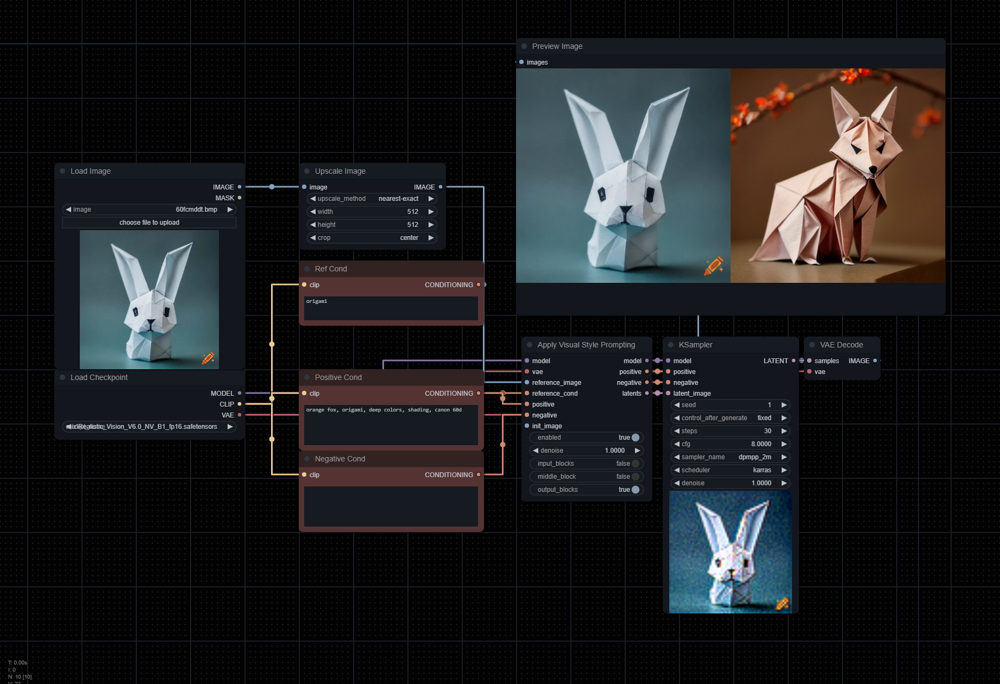

# ComfyUI_VisualStylePrompting
ComfyUI Version of "Visual Style Prompting with Swapping Self-Attention"

*credits to @pamparamm*

> [!NOTE]
> This is WIP.
>
> Major changes were made. Please make sure to update your workflows. An updated workflow can be found in the `workflows` directory.

Implements the very basics of [Visual Style Prompting](https://github.com/naver-ai/Visual-Style-Prompting) by Naver AI.

## Getting Started

Clone the repository into your `custom_nodes` folder, and you'll see `Apply Visual Style Prompting` node. It should be placed between your sampler and inputs like the example image.
This has currently only been tested with 1.5 based models.

- `reference_latent`: VAE-encoded image you wish to reference,
- `positive`: Positive conditioning describing output image.
- `reference_cond`: Conditioning describing reference image.
- `enabled`: Enables or disables the effect. Note that this node will still be hooked even after disabling unless you remove it.
- `denoise`: Works the same way Img2Img works, but utilized with reference and / or init images (this is experimental).
- `input_blocks`: Focuses attention on the encoder layers.
- `middle_block`: Focuses attention on the middle layers.
- `output_blocks`: Focuses attention on the decoder layers.

> [!TIP]
> In order to get the best results (matching legacy functionality), you must use the same prompt for `positive` and `reference_cond`.
>
> The example workflow uses the following for both conds:
>
> `orange fox, origami, deep colors, shading, canon 60d`.

## Notes

- Currently, this method utilized the VAE Encode & Inpaint method as it needs to iteralively denoise on each step.
Due to how this method works, you'll always get two outputs. To remove the reference latent from the output, simple use a Batch Index Select node.

- For legacy functionality, please pull this [PR](https://github.com/ExponentialML/ComfyUI_VisualStylePrompting/tree/712a41579e730c5db87d68c2dcde4e92c48ab2cc).
