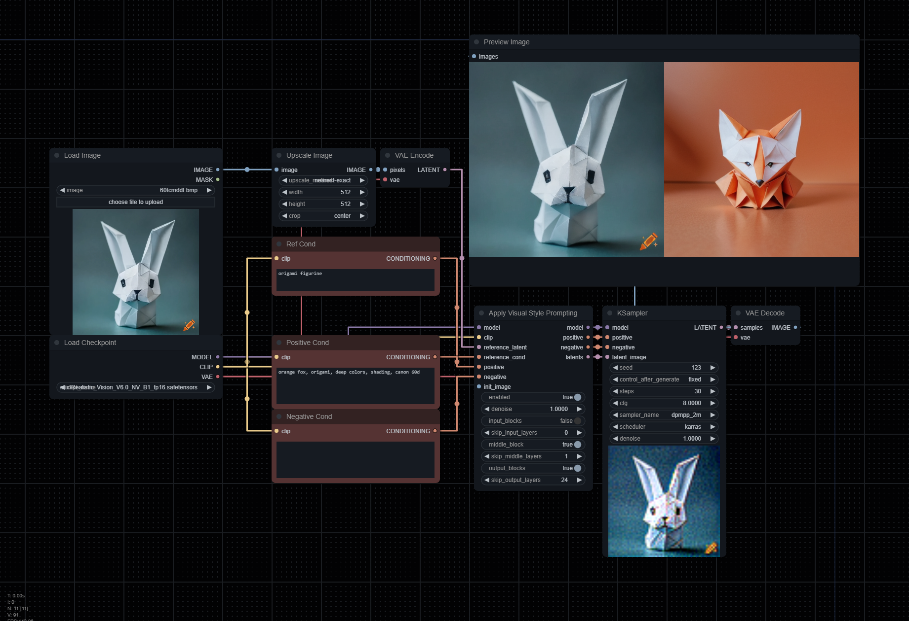

# ComfyUI_VisualStylePrompting
ComfyUI Version of "Visual Style Prompting with Swapping Self-Attention"

*credits to @pamparamm*

> [!NOTE]
> This is WIP.
>
> Major changes were made. Please make sure to update your workflows. An updated workflow can be found in the `workflows` directory.

Implements the very basics of [Visual Style Prompting](https://github.com/naver-ai/Visual-Style-Prompting) by Naver AI.

## Getting Started

Clone the repository into your `custom_nodes` folder, and you'll see `Apply Visual Style Prompting` node. It should be placed between your sampler and inputs like the example image.
This has currently only been tested with 1.5 based models.

- `reference_latent`: VAE-encoded image you wish to reference,
- `positive`: Positive conditioning describing output image.
- `reference_cond`: Conditioning describing reference image.
- `enabled`: Enables or disables the effect. Note that this node will still be hooked even after disabling unless you remove it.
- `denoise`: Works the same way Img2Img works, but utilized with reference and / or init images (this is experimental).
- `input_blocks`: Focuses attention on the encoder layers.
- `skip_input_layers`: Number of layers in the input block that will **not** have swapping self-attention applied to them.
- `middle_block`: Focuses attention on the middle layers.
- `skip_middle_layers`: Number of layers in the middle block that will **not** have swapping self-attention applied to them.
- `output_blocks`: Focuses attention on the decoder layers.
- `skip_output_layers`: Number of layers in the output block that will **not** have swapping self-attention applied to them.

> [!TIP]
> In order to get the best results, you must engineer both `positive` and `reference_cond` prompts correctly. Focus on the details you want to derive from the image reference, and the details you wish to see in the output.
>
> The example workflow uses the following for the `positive` cond:
>
> `orange fox, origami, deep colors, shading, canon 60d`.
>
> And for the `reference_cond`:
>
> `origami figurine`

## Notes

- Currently, this method utilized the VAE Encode & Inpaint method as it needs to iteralively denoise on each step.
Due to how this method works, you'll always get two outputs. To remove the reference latent from the output, simple use a Batch Index Select node.

- For legacy functionality, please pull this [PR](https://github.com/ExponentialML/ComfyUI_VisualStylePrompting/tree/712a41579e730c5db87d68c2dcde4e92c48ab2cc).
